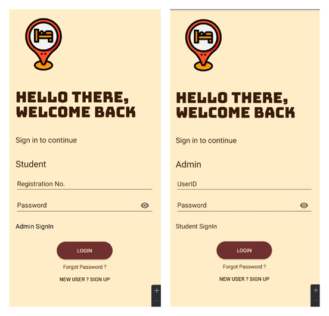
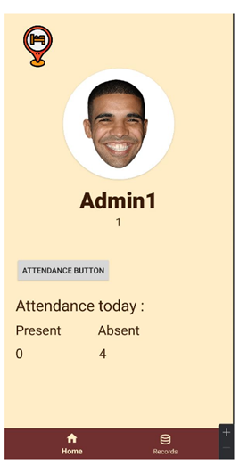
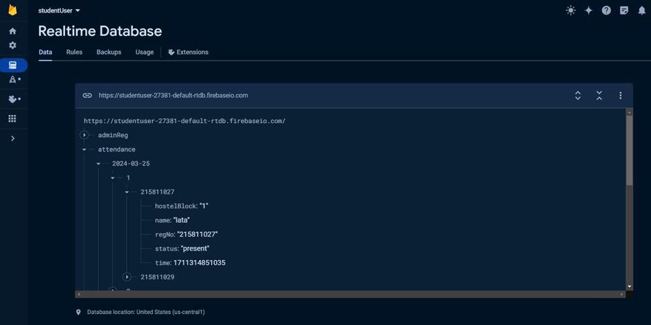

# GeoHostel: Location-Based Hostel Attendance App
GeoHostel is a mobile application for Android devices that leverages location-based services and biometric authentication to offer a convenient and secure method for MAHE Bengaluru hostel residents to mark their attendance.

## Features

* User Authentication: Secure login for students and administrators
* Location-Based Tracking: Geofencing to ensure students are within hostel premises
* Biometric Authentication: Fingerprint verification for attendance marking
* Real-Time Attendance Data: Instant updates to the database
* Admin Controls: Manage attendance, view reports, and control the attendance marking process

## Screenshots

## Download
Download GeoHostel APK

## Technologies Used
Android Studio
Java
Firebase Realtime Database
Google Play Services Location API
BiometricPrompt API

## Installation
Download the APK file from the link above.
Enable installation from unknown sources in your Android settings.
Install the app on your Android device.

## Usage

### For Students:
Sign up using your registration number and other details.
Log in to the app.
When within hostel premises during designated hours, tap the "Present" button.
Authenticate using your fingerprint to mark attendance.

### For Administrators:
Log in using admin credentials.
Control the availability of the attendance marking feature.
View real-time attendance reports and manage student data.